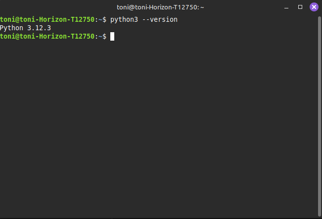
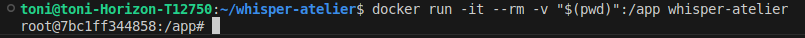
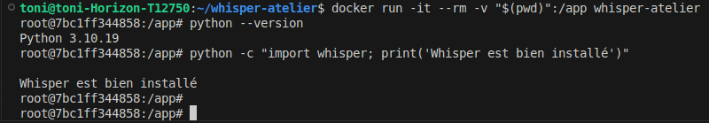
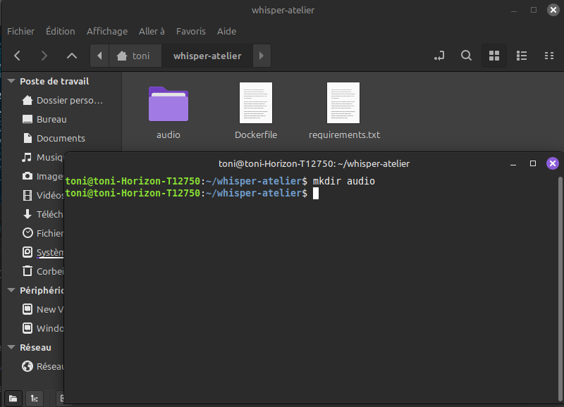
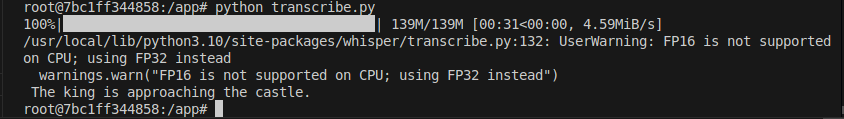

+++
title = "Atelier"
weight = 4
+++

## Objectif

**L'objectif de cet atelier est d'installer Whisper et de l'utiliser librement dans une application Web.**

### La première étape : Préparation de l'environnement

> Tout d'abord, il faut savoir que pour faire fonctionner Whisper sur notre ordi, il faut installer 5 items différents.

### 1. Construire l'image Docker

> Le premier item à installer est Python. Python est le language de programmation que WhisperAI utilise!

Selon ce qui est écrit dans le répertoire [Github](https://github.com/openai/whisper) de Whisper par OpenAI, Python 3.9.9 a été utilisé pour entraîner leur modèles, mais leur code devrait fonctionner avec Python de 3.8 à 3.11. POUR ÊTRE SÛR d'éviter les bugs, on utilisera la `version 3.10`, une version un peu plus à jour que 3.9, mais toujours supportée par Whisper.

> [!info]
> `ATTENTION !!`<br>
> - Linux utilise Python pour son fonctionnement interne, donc on ne doit jamais modifier la
    version système. Pour pouvoir travailler avec Whisper, on va installer Python 3.9 séparément et on l'utilisera via un environnement isolé, et ce en utilisant Docker.

Tout d'abord, il faut vérifier la verison de Python qu'on a sur notre système Linux. Si vous avez déjà la bonne version d'installée, vous pouvez passer à la prochaine étape, Installer Whisper. <br>
Dans mon cas personnel, sur mon Linux Mint, j'ai la version 3.12.3. Pour vous, cela peut-être différent, mais ça n'affectera pas notre travail.



La prochaine étape est de vérifier que nous avons docker. Je ne vais pas expliquer comment installer docker, on a eu un atelier dessus au début de la session et je l'ai déjà fait au début de la session.

``` bash
toni@toni-Horizon-T12750:~$ docker --version
Docker version 28.2.2, build 28.2.2-0ubuntu1~24.04.1
```

Maintenant que les vérifications faites, la première chose à faire est de créer un dossier qui va contenir tous les fichiers nécessaires (Dockerfile, le code Python, etc.). Vous pouvez nommer le dossier comme vous voulez, mais pour cet atelier, je vais le nommer whisper-atelier

``` bash
$ mkdir whisper-atelier

$ cd whisper-atelier
```

On va préparer ensuite un Dockerfile avec Python 3.10.

Le but est d'utiliser Docker pour créer un environnement isolé, ainsi, on ne touchera pas au Python de l'environnement interne de notre système Linux.

Une fois qu'on est dans le répertoire (c'est mieux de l'ouvrir dans vscode), on crée un fichier et on le nomme `Dockerfile` (sans extension). On va installer la version slim, qui est plus légère et donc son téléchargement sera plus rapide. On fait juste ce qui est nécessaire pour partir Whisper sur un système minime. Dans le Dockerfile, vous pouvez copier coller les lignes ci bas:

``` bash
FROM python:3.10-slim

# 1. Dépendances système (ffmpeg = obligatoire pour Whisper)
RUN apt-get update && apt-get install -y \
    ffmpeg \
    git \
 && rm -rf /var/lib/apt/lists/*

# 2. Dossier de travail
WORKDIR /app

# 3. Installation des dépendances Python
COPY requirements.txt .
RUN pip install --no-cache-dir -r requirements.txt

# 4. On laisse le container démarrer dans /app avec un shell
CMD ["bash"]
```
***À propos de ffmpeg :***
- Il est super important, car c'est lui qui lit (sert à décoder) les fichiers audio (mp3, wav, m4a, etc.)
- Whisper s'appuie dessus pour convertir l'audio en format utilisable par le modèle.

<br>

Un deuxième fichier doit être créé, et on le nomme `requirements.txt`.<br>
Requirements contient tout ce qui est requis/obligatoire en fait.

> torch : PyTorch est la grosse librairie de deep learning dont Whisper a besoin. <br>
> openai-whisper : la librairie Whisper elle même. <br>
> tiktoken : l'outil de tokenization utilisé en interne par Whisper.

Vous pouvez copier coller les lignes ci bas dedans:

``` bash
torch
openai-whisper
tiktoken
```

Maintenant qu'on a ces deux fichiers prêts, la prochaine étape est de faire le build!
Dans le bash, on peut faire cette commande pour construire l'image Docker avec toutes les conditions qu'on a donné dans le Dockerfile et le fichier requirements.txt

``` bash
docker build -t whisper-atelier .
```

- `docker build` : construit l'image
- `-t whisper-atelier` : donne un nome à l'image
- `.` : le contexte de build, en d'autres mot on choisit de faire le build dans le dossier courant

<br>
Le build va prendre beaucoup de temps, mais c'est normal. Ce qu'on installe est vraiment loud et cela peut prendre du temps pour tout installer. Une fois que c'est finit, vous devrez voir ces deux lignes:

``` bash
Successfully built <id>
Successfully tagged whisper-atelier:latest
```

Maintenant que l'image est construite, on va entrer dans le conteneur.

``` bash
docker run -it --rm -v "$(pwd)":/app whisper-atelier
```
On démarre un conteneur à partir de l'image :
- `-it` : mode interactif, pour avoir un shell dedans.
- `--rm` : le conteneur est supprimé quand on quitte, ce qui évite d'en accumuler (gestion de mémoir)
- `-v "$(pwd)":/app` : on monte notre dossier courant dans /app dans le conteneur (de cette façon, on a des fichiers partagés entre notre PC et Docker)
- `whisper-atelier` : le nom de l'image qu'on vient de construire

Une fois cela fait, notre prompt va changer vers un truc du genre : 
``` bash
root@<id_du_conteneur>:/app#
```

Dans mon cas, c'est ça que c'est devenu : 


Normalement, l'environnement devrait être prêt!


## Tester Whisper

On se prépare maintenant à tester Whisper. 

Allez dans le dossier whisper-atelier, notre **dossier local**, pas dans Docker.
On cré dedans un dossier `audio`, dans lequel on va mettre des fichiers audio .mp3 ou .wav.



J'ai utilisé le site [Sample Focus](https://samplefocus.com/categories/spoken?min_tempo=0&max_tempo=200&min_duration=0&max_duration=30.8)
pour trouver des échantillons de voix ou de personnes qui parlent. Sur ce site, on peut créer notre compte et avoir le droit de télécharger 5 échantillons gratuitement.

Une fois que vous avez choisi vos échantillons, vous devez les mettre dans le dossier audio qu'on a créé tantôt.


<br>
Pour pouvoir transcrire les fichiers audio, nous avons besoin de créer un nouveau fichier qu'on va appeler `transcribe.py`.

Dedans, on va mettre ce code là :

``` bash
import whisper

# 1. Charger le modèle Whisper
model = whisper.load_model("base")

# 2. Transcrire le fichier audio
result = model.transcribe("audio/normalEnglish.wav")

# 3. Afficher le texte transcrit
print(result["text"])
```

- `import whisper` : on importe la librairie Whisper installée dans le conteneur
- `load_model("base")` : ce modèle offre un compromis entre vitesse et précision, alors parfait pour un atelier!
- `transcribe(...)` : C'est cette commande qui nous permet de tout transcrire. Elle charge l'audio, le découpe, extrait des features (Mel spectogram), passe tout ça dans un Transformer et génère du texte.
- `result["text"]` : Finalement, on dit que le résultat est un dictionnaire (texte, langue, segments, timestamps...)

<br>

**Maintenant que tout est prêt, on peut FINALEMENT exécuter le script!**

Pour ce faire, il suffit d'ouvrir le terminal et d'écrire : 

``` bash
python transcribe.py
```



> Le warning qu'on voit ici est lié au fait que Whisper utilise le CPU plutôt que le GPU. Normalement, Whisper préfère utiliser le GPU, car le CPU ne supporte pas efficacement le FP16.<br>
> Normalement, Whisper détecte automatiquement le matériel disponible. Dans notre conteneur, il n'y a pas de GPU, uniquement le CPU. <br>
> <br>
> **Message (résumé) :** <br>
>   FP16 is not supported on CPU, using FP32 instead <br>
> <br>
> **La différence entre FP16 et FP32 :**
> - FP16 (float16): calculs en demi-précisions 
>   - plus rapide,
>   - moins de mémoire
>   - surtout utilisé sur GPU
> - FP32 (float32): calculs en précision normale
>   - plus lents
>   - plus précis
>   - standard sur CPU


Whisper est conçu pour fonctionner aussi bien sur GPU que sur CPU. Quand il n'y a pas de GPU ou qu'il n'est pas disponible, le modèle bascule automatiquement en calculs FP32 (float32) plutôt que FP16, puisque les calculs FP16 sont optimisés pour les GPU.

Cette façon de s'adapter permet à Whisper d'être compatible sur tous les systèmes, au prix d'un temps de calcul un peu plus élevé.

> [!info]
> Il faut savoir qu'on peut forcer le modèle à utiliser le CPU si on 
> veut. Pour ce faire, il suffit de lancer cette commande : <br>
> `model = whisper.load_model("base", device="cpu")`


## Mini Application Web

Maintenant, puisqu'on a Whisper qui fonctionne bien dans Docker, tout ce qui nous reste c'est de créer une mini application Web et d'implémenter Whisper dedans.

L'application sera construite avec 3 éléments seulement :
- Un petit backend python
- Une interface web simple
- Le tout tourne dans docker

### Backend FastAPI

On va commencer par créer le backend python avec l'aide de FastAPI. Ce sera un backend minimal qui aura comme tâches de :
- Démarrer correctement
- Exposer une API

Le premier truc à faire est de rajouter ces deux lignes dans le fichier `requirements.txt` :
``` bash
fastapi
uvicorn
```

Maintenant qu'on a ajouté ça, on va reconstruire l'image Docker. Pour ce faire, on va refaire la même commande :

``` bash
docker build -t whisper-atelier .
```

> Si vous êtes encore dans root, il suffit de faire `exit` pour sortir du container !

On va encore une fois attendre que la construction de l'image Docker fini. Une fois que c'est fait, on peut procéder et créer le fichier app.py à la racine du projet !

> Au même niveau de Dockerfile

Dedans, on va mettre ces lignes de code : 

``` bash
from fastapi import FastAPI

app = FastAPI()

@app.get("/")
def root():
    return {"message": "Backend Whisper OK"}
```

Ce que fait ce fichier est :
- Créer une application web
- Définit une route principale `/`
- Quand on l'ouvre, on reçoit du JSON

La prochaine étape est tout simplement démarrer le backend dans Docker !

``` bash
docker run -it --rm -p 8000:8000 -v "$(pwd)":/app whisper-atelier \
uvicorn app:app --host 0.0.0.0 --port 8000
```

- `-it` : permet de voir et d'interagir avec le container 
    - cominaison de `-i` (crée un terminal (TTY)) et `-t` (mode interactif) 
- `--rm` : supprime le container automatiquement quand on le quitte (gestion de mémoire)
- `-p 8000:8000` : C'est le pont entre notre machine et le container. On définit les ports utilisés en fait.
    - Format : `-p PORT_MACHINE:PORT_CONTAINER`
- `-v "$(pwd)":/app` : On dit tout simplement de partager un dossier précis entre la machine principale et le container
    - `$(pwd)` : C'est le dossier actuel sur notre machine
    - `/app` : C'est le dossier dans le container
- `uvicorn app:app` : On démarre le serveur web
    - Le premier `app` est le fichier `app.py` et le deuxième `app` est tout simplement la variable app = FastAPI()
- `--host 0.0.0.0` : Permet l'accès depuis l'extérieur du container (liens entre la machine et docker)
- `--port 8000` : Ici, on fait tout simplement démarrer le serveur sur le port 8000 dans le container !

Le résultat en partie de tout ça est qu'on fait en sorte que `app.py` et `transcribe.py` etc. sont visibles dans Docker. Donc, on n'a pas besoin de rebuild à chaque modification !

<br>

> ***RÉCAPITULATIF*** <br>
> Pour le moment, on a créé un backend avec FastAPI, mais sans Whisper pour le moment. Tout devrait fonctionner! Voici ce que vous devrez voir une fois vous ouvrez le site web `http://127.0.0.1:8000/`


### Intégrer Whisper au Backend

> Maintenant, on est rendu à la partie intéressante! On va intégrer Whisper dans le backend web pour pouvoir faire un service de transcription accessible via une `API`!

Il faut comprendre que avant, il tournait seul, en local, via un script ou une commande.

On va mettre à jour le fichier `app.py` pour lui permettre de laisser Whisper embarquer dans un serveur backend.  

``` bash
from fastapi import FastAPI, UploadFile, File
import whisper
import tempfile
import os

app = FastAPI()

model = whisper.load_model("base")

@app.get("/")
def root():
    return {"message": "Backend Whisper OK"}

@app.post("/transcribe")
async def transcribe_audio(file: UploadFile = File(...)):
    # On crée un fichier temporaire pour stocker l'audio uploadé
    with tempfile.NamedTemporaryFile(delete=False) as temp_audio:
        temp_audio.write(await file.read())
        temp_path = temp_audio.name

    # Transcription
    result = model.transcribe(temp_path)

    # Nettoyage pour la gestion de mémoire
    os.remove(temp_path)

    return {
        "filename": file.filename,
        "text": result["text"]
    }
```

On va arrêter le serveur et le relancer pour voir les changements!

> - Pour arrêter le serveur, il suffit de faire `Ctrl + C`. <br>
> - Pour relancer le serveur, il suffit de faire `docker run -it --rm -p 8000:8000 -v "$(pwd)":/app whisper-atelier \
uvicorn app:app --host 0.0.0.0 --port 8000
`

> [!info]
> Il est très propable que vous ayez une erreur en essayant de redémarrer le serveur : `RuntimeError: Form data requires "python-multipart" to be installed. 
You can install "python-multipart" with: 
> pip install python-multipart` <br>
> <br>
> SI ça arrive, ne vous inquiétez pas. Puisqu'on demande `UploadFile`, FastAPI vérifie tout ce qu'il a et constate qu'il lui manque `python-multipart`.

Pour régler l'erreur, on DOIT rebuild, ou reconstruire l'image Docker.

AVANT de reconstruire l'image, assurez vous que votre fichier `requirements.txt` contient `python-multipart`. S'il n'est pas là, ajoutez le.

<br>

**REBUILD L'IMAGE DOCKER**
``` bash
docker build -t whisper-atelier .
```

> Ça peut prendre un peu de temps, encore, mais c'est normal. L'image est lourde.

**Une fois que la reconstruction de l'image Docker est fini, on s'assure de refaire rouler l'application.**

``` bash
docker run -it --rm -p 8000:8000 -v "$(pwd)":/app whisper-atelier \
uvicorn app:app --host 0.0.0.0 --port 8000
```

**Pour récapituler :**
> On a créé une mini application backend qui permet de transcrire un fichier audio en texte grâce à Whisper. <br>
> Cette application expose une API HTTP avec FastAPI

Pour accéder à cette application qu'on vient de faire, il suffit d'aller là : `http://127.0.0.1:8000/docs`

> La page `http://127.0.0.1:8000/docs` est une documentation automatique générée par FastAPI. Elle montre comment on peut utiliser notre backend!

Si on regarde bien, on peut voir des routes, la route 1 étant `Get` et la route 2 étant `POST`.

La route 1 sert simplement à vérifier que le backend fonctionne. Quand on l'appelle, elle renvoie un simple message "Backend Whisper OK". 

La route 2 sert à nous laisser intéragir avec Whisper et ainsi faire la transcription!

Ce que cette route attend est un fichier audio (format `.wav`, `.mp3`, etc.)

***Ce que fait le backend :***
- En premier, backend reçoit le fichier audio
- Deuxièmement, il le sauvegarde temporairement sur le serveur
- Whisper analyse l'audio et génère le texte
- En suite, le fichier temporaire est supprimé
- Et finalement, le backend retourne le résultat en JSON

Voici un exemple de réponse:
``` bash
{
  "filename": "LeNomDuFichierAudio.extension",
  "text": "Ici sera le texte transcrit du fichier audio."
}
```

### Ajout des autres fonctionnalités

Maintenant qu'on sait que le backend et Whisper fonctionnent correctement, on peut procéder et ajouter le reste des fonctionnalités! 

Pour bien le mettre au claire, voici les **principales fonctionnalités** de Whisper :
1. Transcription dans la langue originale
2. Détection de la langue
3. Traduction en anglais

Donc, maintenant, on va implémenter la détection de la langue et la traduction en anglais.

Pour ce faire, on va modifier `app.py` pour ajouter les commandes requises, dans la requêtes transcribe, qui permettent de faire ce qu'on veut faire.

``` bash
from fastapi import FastAPI, UploadFile, File
import whisper
import tempfile
import os

app = FastAPI()

model = whisper.load_model("base")

@app.get("/")
def root():
    return {"message": "Backend Whisper OK"}

@app.post("/transcribe")
async def transcribe_audio(file: UploadFile = File(...)):
    # 1. Sauvegarder l'audio reçu dans un fichier temporaire
    with tempfile.NamedTemporaryFile(delete=False, suffix=".wav") as temp_audio:
        temp_audio.write(await file.read())
        temp_path = temp_audio.name

    # 2. Transcription normale (langue d'origine)
    result = model.transcribe(temp_path)  # ex: texte en français
    original_text = result["text"]
    detected_language = result["language"]

    # 3. Traduction en anglais
    translated = model.transcribe(temp_path, task="translate")
    translated_text = translated["text"]

    # 4. Nettoyage
    os.remove(temp_path)

    # 5. Réponse JSON
    return {
        "filename": file.filename,
        "language": detected_language,
        "text_original": original_text,
        "text_english": translated_text
    }
```

> Bien sûr, on s'assure de reconstruire l'image de Docker encore une fois. En suite, on relance Docker pour voir notre résultat.

Allez à nouveau à `http://127.0.0.1:8000/docs#/` pour pouvoir tester tout ça!

1. Allez sur POST
2. Cliquez **Try it out**
3. Cliquez **Parcourir...** et choisissez un fichier audio
4. Cliquez sur **Execute**

***Voici par exemple ce que moi j'ai eu :***


<br>

## FRONTEND

Notre application fonctionne. MAIS. Elle n'est pas très intuitive. Donc, pour régler cela, on va créer une page static Frontend pour l'embellir un peu.

Tout d'abord, on va ajouter cet import `from fastapi.responses import HTMLResponse` à `app.py`.

Le but est que GET ne renvoie plus du JSON, mais du HTML.

Du coup, on va remplacer notre ancien `@app.get("/")` par ça :

``` bash
@app.get("/", response_class=FileResponse)
def root():
    # Retourne le fichier index.html situé dans /app (racine du projet dans le container)
    return "index.html"
```

> `FileResponse` dit à FastAPI de renvoyer le fichier tel quel
> Quand on va sur `http://127.0.0.1:8000/`, FastAPI renvoie inde.html, qu'on va créer maintenant.
<br>
Il ne faut pas oublier aussi de rajouter cet import !
`from fastapi.responses import FileResponse`


**Créations du HTML**

On va créer un fichier HTML, on va le nommer `index.html` et on va mettre ce code dedans :

``` html
<!DOCTYPE html>
<html lang="fr">
<head>
    <meta charset="UTF-8">
    <title>Mini démo Whisper</title>
    <style>
        body {
            font-family: system-ui, -apple-system, BlinkMacSystemFont, "Segoe UI", sans-serif;
            max-width: 600px;
            margin: 40px auto;
        }
        h1 { margin-bottom: 0.5rem; }
        .card {
            border: 1px solid #ddd;
            border-radius: 8px;
            padding: 16px;
            margin-top: 16px;
        }
        button {
            margin-top: 8px;
            padding: 8px 16px;
            cursor: pointer;
        }
        #result {
            white-space: pre-wrap;
            margin-top: 12px;
            border: 1px solid #eee;
            padding: 8px;
            border-radius: 4px;
            min-height: 40px;
        }
    </style>
</head>
<body>
    <h1>Atelier Whisper – Mini application</h1>
    <p>
        Cette interface envoie un fichier audio au backend FastAPI
        (endpoint <code>/transcribe</code>) qui utilise le modèle Whisper pour le transcrire.
    </p>

    <div class="card">
        <h2>1. Choisir un fichier audio</h2>
        <input type="file" id="audioFile" accept="audio/*">
        <br>
        <button id="btnTranscribe">Transcrire</button>

        <h2>2. Résultat de la transcription</h2>
        <div id="status"></div>
        <div id="result"></div>
    </div>

    <script>
        const fileInput = document.getElementById("audioFile");
        const btnTranscribe = document.getElementById("btnTranscribe");
        const statusDiv = document.getElementById("status");
        const resultDiv = document.getElementById("result");

        btnTranscribe.addEventListener("click", async () => {
            const file = fileInput.files[0];

            if (!file) {
                alert("Choisis d'abord un fichier audio.");
                return;
            }

            statusDiv.textContent = "Envoi du fichier et transcription en cours...";
            resultDiv.textContent = "";

            const formData = new FormData();
            formData.append("file", file);

            try {
                const response = await fetch("/transcribe", {
                    method: "POST",
                    body: formData
                });

                let data = null;
                try {
                    data = await response.json();
                } catch {
                    data = null;
                }

                if (!response.ok) {
                    statusDiv.textContent = "Erreur côté serveur (HTTP " + response.status + ")";
                    resultDiv.textContent = data ? JSON.stringify(data) : "Réponse invalide du serveur.";
                    return;
                }

                statusDiv.textContent = "Transcription terminée.";

                resultDiv.textContent = `
Fichier : ${data.filename}
Langue détectée : ${data.language}

--- Texte original ---
${data.text_original}

--- Traduction anglaise ---
${data.text_english}
                `.trim();

            } catch (err) {
                console.error(err);
                statusDiv.textContent = "Erreur lors de l'appel à l'API.";
            }
        });
    </script>
</body>
</html>
```

***Côté HTML :***

> Dans la page HTML, c'est grâce à `<input type="file">` qu'on peut choisir un audio. <br>
> On a aussi un bouton `Transcrire` <br>
> Et une zone pour afficher le texte renvoyé <br>

***Côté JavaScript :***
> On récupère le fichier choisi, <br>
> On le met dans un FormData juste sous le champ `file` <br>
> On envoie ça en POST vers `/transcribe` avec `fetch` <br>
> Et finalement, on affiche `data.text` qui est retourné par le backend, par Whisper <br>

Avant de reconstruire l'image Docker et tester l'application, on revérifier que toutes nos fichiers correspondent à ceux listés ci dessous.

***app.py***:
``` bash
from fastapi import FastAPI, UploadFile, File
import whisper
import tempfile
import os
from fastapi.responses import FileResponse

app = FastAPI()

model = whisper.load_model("base")

@app.get("/")
def root():
    return FileResponse("index.html")


@app.post("/transcribe")
async def transcribe_audio(file: UploadFile = File(...)):
    temp_path = None

    try:
        # 1) Sauvegarder l'audio dans un fichier temporaire
        suffix = os.path.splitext(file.filename)[1] if file.filename else ".tmp"
        with tempfile.NamedTemporaryFile(delete=False, suffix=suffix) as temp_audio:
            temp_audio.write(await file.read())
            temp_path = temp_audio.name

        # 2) Transcription (langue d'origine)
        result = model.transcribe(temp_path)
        original_text = result["text"]
        detected_language = result["language"]

        # 3) Traduction en anglais
        translated = model.transcribe(temp_path, task="translate")
        translated_text = translated["text"]

        # 4) Réponse JSON
        return {
            "filename": file.filename,
            "language": detected_language,
            "text_original": original_text,
            "text_english": translated_text
        }

    finally:
        # 5) Nettoyage (même si ça plante)
        if temp_path and os.path.exists(temp_path):
            os.remove(temp_path)
```

***index.html*** :
``` bash
<!DOCTYPE html>
<html lang="fr">
<head>
    <meta charset="UTF-8">
    <title>Mini démo Whisper</title>
    <style>
        body {
            font-family: system-ui, -apple-system, BlinkMacSystemFont, "Segoe UI", sans-serif;
            max-width: 600px;
            margin: 40px auto;
        }
        h1 { margin-bottom: 0.5rem; }
        .card {
            border: 1px solid #ddd;
            border-radius: 8px;
            padding: 16px;
            margin-top: 16px;
        }
        button {
            margin-top: 8px;
            padding: 8px 16px;
            cursor: pointer;
        }
        #result {
            white-space: pre-wrap;
            margin-top: 12px;
            border: 1px solid #eee;
            padding: 8px;
            border-radius: 4px;
            min-height: 40px;
        }
    </style>
</head>
<body>
    <h1>Atelier Whisper – Mini application</h1>
    <p>
        Cette interface envoie un fichier audio au backend FastAPI
        (endpoint <code>/transcribe</code>) qui utilise le modèle Whisper pour le transcrire.
    </p>

    <div class="card">
        <h2>1. Choisir un fichier audio</h2>
        <input type="file" id="audioFile" accept="audio/*">
        <br>
        <button id="btnTranscribe">Transcrire</button>

        <h2>2. Résultat de la transcription</h2>
        <div id="status"></div>
        <div id="result"></div>
    </div>

    <script>
        const fileInput = document.getElementById("audioFile");
        const btnTranscribe = document.getElementById("btnTranscribe");
        const statusDiv = document.getElementById("status");
        const resultDiv = document.getElementById("result");

        btnTranscribe.addEventListener("click", async () => {
            const file = fileInput.files[0];

            if (!file) {
                alert("Choisis d'abord un fichier audio.");
                return;
            }

            statusDiv.textContent = "Envoi du fichier et transcription en cours...";
            resultDiv.textContent = "";

            const formData = new FormData();
            formData.append("file", file);

            try {
                const response = await fetch("/transcribe", {
                    method: "POST",
                    body: formData
                });

                let data = null;
                try {
                    data = await response.json();
                } catch {
                    data = null;
                }

                if (!response.ok) {
                    statusDiv.textContent = "Erreur côté serveur (HTTP " + response.status + ")";
                    resultDiv.textContent = data ? JSON.stringify(data) : "Réponse invalide du serveur.";
                    return;
                }

                statusDiv.textContent = "Transcription terminée.";

                resultDiv.textContent = `
Fichier : ${data.filename}
Langue détectée : ${data.language}

--- Texte original ---
${data.text_original}

--- Traduction anglaise ---
${data.text_english}
                `.trim();

            } catch (err) {
                console.error(err);
                statusDiv.textContent = "Erreur lors de l'appel à l'API.";
            }
        });
    </script>
</body>
</html>
```

***transcribe.py*** :
``` bash  
import whisper

# 1. Charger le modèle Whisper
model = whisper.load_model("base")

# 2. Transcrire le fichier audio
result = model.transcribe("audio/normalEnglish.wav")

# 3. Afficher le texte transcrit
print(result["text"])
```

***Dockerfile*** :
``` bash
FROM python:3.10-slim

# 1. Dépendances système (ffmpeg = obligatoire pour Whisper)
RUN apt-get update && apt-get install -y \
    ffmpeg \
    git \
 && rm -rf /var/lib/apt/lists/*

# 2. Dossier de travail
WORKDIR /app

# 3. Installation des dépendances Python
COPY requirements.txt .
RUN pip install --no-cache-dir -r requirements.txt

# 4. On laisse le container démarrer dans /app avec un shell
CMD ["bash"]
```

***requirements.txt*** :
``` bash
torch
openai-whisper
tiktoken
fastapi
uvicorn
python-multipart
```

---

Assurez vous d'avoir ces mêmes fichiers avant d'exécuter les commandes et de tester votre application ! J'ai testé ça plusieurs fois et tout fonctionne, donc vous ne devrez pas avoir de problèmes.

---

Une fois on a fait tout ça, on devrait être prêt pour un rebuild de Docker encore!

> [!info]
> Pour rappelle, voici la commande à utiliser pour un build : `docker build -t whisper-atelier .` <br>
<br>
> Et voici la commande pour relancer le backend : `docker run -it --rm -p 8000:8000 -v "$(pwd)":/app whisper-atelier \
uvicorn app:app --host 0.0.0.0 --port 8000
`

---

## Lien Repos Github
Ici, vous trouverez l'application qu'on vient de faire ensemble faite et fini, si vous voulez comparer! <br>
<br>
Voici le lien: <br>
https://github.com/ToniEliamokhtar/WhisperAI