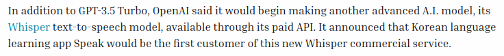

+++
title = "Notes de cours"
weight = 3
+++

### C'est quoi au juste, WhisperAI?

WhisperAI est un système de reconnaissance automatique de la parole, développé par OpenAI.  
Il a été mis en ligne sous licence *open-source* le 21 septembre 2022. 

Il faut savoir que WhisperAI a trois principales fonctionnalités :
- Transcription
- Traduction vers l'anglais
- Identification de la langue

Whisper est un outil très utile et polivalent, puisqu'on peut aussi le lancer sur mobile, ordinateur ou Raspberry Pi

### Entraînement

Whisper a été entraîné sur **680 000 heures** de données audio, ce qui est un volume extrêmement élevé comparé aux datasets ASR (Automatic Speech Recognition) classiques.  

Ce volume de données permet à WhisperAI d'avoir une approche généraliste pour comprendre les fichiers audio, pas spécialiste ! Je vais revenir sur ça plus bas dans les notes de cours.  

En fait, normalement, les ASR classique sont très souvent entraînés sur quelques *centaines* à quelques *milliers* d'heures. Ils sont normalement entraînés sur des corpus propres et contrôlés.

> Un Corpus est un ensemble de données utilisé pour entraîner un modèle !

 

***Données et provenance***

Whisper a été entraîné majoritairement sur des donées qui proviennent du Web. Cela peut inclure des enregistrements audio très variées, comme :
- Des entrevues
- Des conférences
- Des vidéos (que ce soit de Youtube ou de n'importe quelle platforme)
- Des podcasts 
- Et pleins de discussions enregistrées dans de plusieurs contextes réels et variés. 

Ces enregistrements regroupent *plusieurs langues et accents* et portent sur des *tâches diverses*. 

Contrairement à des données enregistrées spécifiquement pour l'entraînement d'un modèle de reconnaissance vocale, ces fichiers audio ne sont pas produits dans des conditions idéales et contrôlées!

Voici une information résultant de l'entraînement si général de whisper:   
- Whisper est capable de fonctionner avec plus de 96 langues différentes !!

 

***Utilisations principales***

WhisperAI est utilisé dans de très diverse situations, il y a aussi de grandes compagnies qui s'en servent !

Voici des exemples de grandes compagnies qui utilisent cet ASR via ChatGPT :
- Snap Inc (Un géant dans les réseaux sociaux)
- Shopify (Plateforme qui permet la création, la gestion et le développement de boutiques en ligne)
- Instacart (Service de livraison de courses en ligne disponible aux États-Unis et au Canada)
- Quizlet (Plateforme d'apprentissage en ligne, ressemble un peu à Kahoot)
    - `Source` : Article écrit par Jeremy Kahn Mars, 1, 2023 à 13h sur le site Fortune.

Selon ce même article, ces quatres entreprises ont pris la décision de laisser leurs utilisateurs parler directement avec ChatGPT. Il faut savoir que présentement, ChatGPT utilise WhisperAI pour la transcription de voix vers texte, pour lui permettre d'analyser la demande de l'utilisateur. Cela implique l'utilisation de WhisperAI, étant l'une des technologies développées par OpenAI et utilisée par ChatGPT.

Si on parle d'une entreprise qui **utilise directement WhisperAI**, on parlera plutôt de `Speak`. Speak est une application d'apprentissage des langues. Au début, elle était surtout concentré sur le Koréen. Son objectif principal? Faire parler l'utilisateur, pas juste lui faire lire ou écrire. Speak est la première entreprise à vraiment incorporer et utiliser WhisperAI.

 

WhisperAI, altérieurement, peut-être utilisé dans plusieurs contextes. Par exemple :
- Transcription audio à texte
    - Réunions, entrevues, podcasts, enregistrements audio, vidéos
- Reconnaissance automatique des langues
    - Détection et transcription de plusieurs langues
- Tranduction de la parole vers le texte écrit
    - Audio dans une langue étrangère --> texte en anglais par exemple
- Apprentissage des langues
    - Analyse de la prononciation et correction des erreurs à l'oral
- Génération de sous-titres
    - Création automatique de sous-titres pour les contenus audiovisuels
- Interaction vocale avec des applications
    - Conversion de la voix de l'utilisateur en texte afin d'intéragir et parler avec certains systèmes intelligents implémentés dans des applications

### Sources :
Github :
- https://github.com/openai/whisper

Sites :
- https://openai.com/fr-FR/index/whisper/
- https://whisperai.com/
- https://fortune.com/2023/03/01/openai-chatgpt-api-enterprise-commercial-instacart-shopify-snap-quizlet/
- https://music.ai/

Youtube :
- https://youtu.be/ABFqbY_rmEk?si=5cgywGGt3kfzMpZw
- https://youtu.be/RJUXKy60CXM?si=-u8ZMSlemlJblQHr
- https://youtu.be/uFOkMme19Zs?si=9T8u1Z6G2ulQGYi5

Articles:
- https://www.freecodecamp.org/news/how-to-turn-audio-to-text-using-openai-whisper/
- https://www.spocket.co/fr/blogs/comment-fonctionne-shopify
- https://toptips.fr/quest-ce-quinstacart-comment-ca-marche-et-combien-ca-coute/