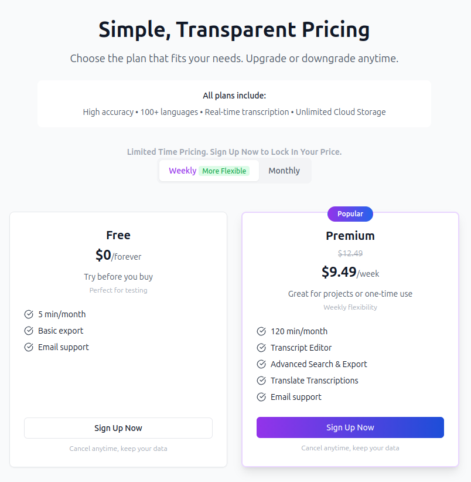
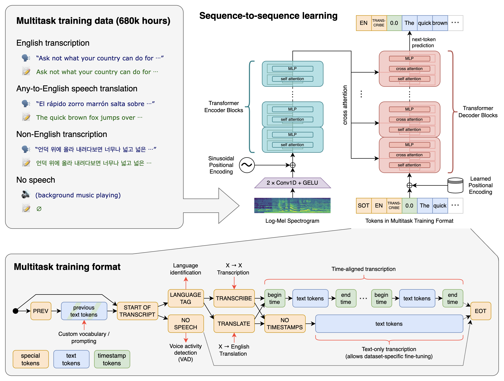
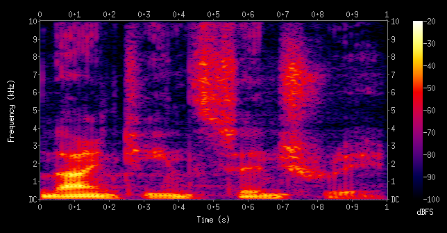
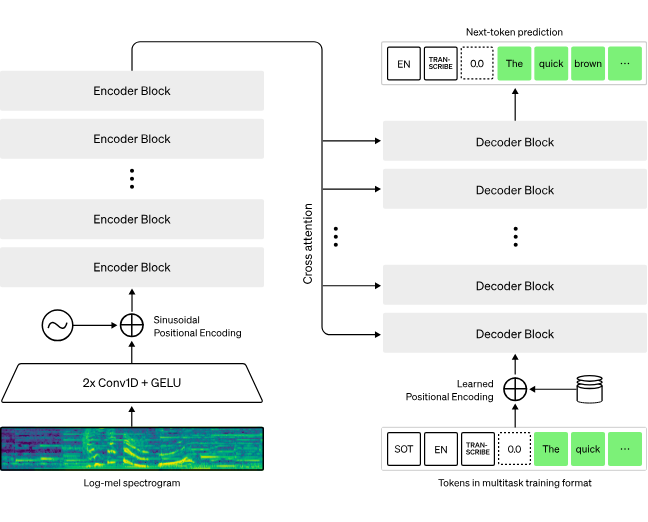

+++
title = "Notes de cours"
weight = 3
+++

## C'est quoi au juste, WhisperAI?

WhisperAI est un système de reconnaissance automatique de la parole, développé par OpenAI.  
Il a été mis en ligne sous licence *open-source* le 21 septembre 2022. 

Il faut savoir que WhisperAI a trois principales fonctionnalités :
- Transcription
- Traduction vers l'anglais
- Identification de la langue

Whisper est un outil très utile et polyvalent, puisqu'on peut aussi le lancer sur mobile, ordinateur ou Raspberry Pi.  
Il prend plusieurs formats de fichiers audio et vidéo jusqu'à 1GB, comme MP3, WAV, M4A, WEBM ainsi que des formats MP4 avec un traitement et transcription rapides.  
Sur le site de WhisperAI, c'est dit qu'il peut exporter plusieurs formats de fichiers, comme PDF, DOCX, TXT out des fichiers de sous-titres SRT avec des horodatages pour le montage vidéo.

Bien qu'il y a plusieurs plans qui donnent de plus en plus d'accès à de plus en plus d'usage, mais le modèle basique gratuit offre 5 minutes par mois, exportation basique et support email.

## Entraînement

Whisper a été entraîné sur **680 000 heures** de données audio, ce qui est un volume extrêmement élevé comparé aux datasets ASR (Automatic Speech Recognition) classiques.  

Ce volume de données permet à WhisperAI d'avoir une approche généraliste pour comprendre les fichiers audio, pas spécialiste ! Je vais revenir sur ça plus bas dans les notes de cours.  

En fait, normalement, les ASR classique sont très souvent entraînés sur quelques *centaines* à quelques *milliers* d'heures. Ils sont normalement entraînés sur des corpus propres et contrôlés.

> Un Corpus est un ensemble de données utilisé pour entraîner un modèle !

 

### - Données et provenance

Whisper a été entraîné majoritairement sur des données qui proviennent du Web. Cela peut inclure des enregistrements audio très variées, comme :
- Des entrevues
- Des conférences
- Des vidéos (que ce soit de Youtube ou de n'importe quelle plateforme)
- Des podcasts 
- Et pleins de discussions enregistrées dans de plusieurs contextes réels et variés. 

Ces enregistrements regroupent *plusieurs langues et accents* et portent sur des *tâches diverses*. 

Contrairement à des données enregistrées spécifiquement pour l'entraînement d'un modèle de reconnaissance vocale, ces fichiers audio ne sont pas produits dans des conditions idéales et contrôlées!

Voici une information résultant de l'entraînement si général de whisper:   
- Whisper est capable de fonctionner avec plus de 100 langues différentes !!

 

### - Type de Supervision

WhisperAI a été entraîné avec des données **supervisées**, mais majoritairement, il a été entraîné avec des données **faiblement supervisées**.

En fait, il faut savoir que sur tous les fichiers audios sur lesquels WhisperAI a été entraîné, il avait toujours le son et le texte déjà transcrit, même si mal transcrit. Il avait toujours le point de départ et un résultat sur lequel il pouvait se comparer à la fin !

La seule différence est que une partie des données de formations étaient supervisées, ce qui veut dire que les fichiers audios étaient choisies par les développeurs et le résultat en texte était déjà là, présent, parfait et vérifié par l'équipe qui s'occupait de l'entraînement de ce modèle. L'autre partie qui constitue la majorité des données provient du web, avec du texte déjà transcrit, mais pas obligatoirement bien. Il y certaines transcriptions qui pouvaient contenir des fautes.

Il y a donc une différence importante entre ces deux types de données. Dans le cas des **données supervisées**, les transcriptions sont fiables et servent de référence solide pour apprendre la correspondance entre les sons et les mots. Cependant, ce type de données est long et coûteux à produire, ce qui limite fortement la quantité disponible !

À l'inverse, les **données faiblement supervisées** permettent d'entraîner le modèle sur un volume beaucoup plus grand de fichiers audio ! Même si certaines transcriptions contiennent des fautes ou des imprécisions, WhisperAI est quand même capable d'apprendre à repérer des patterns récurrents dans la parole et de s'améliorer malgré les erreurs. Le modèle n'apprend donc pas seulement à recopier un texte, mais à faire des prédictions de plus en plus cohérentes à partir du signal audio, et je vais parler de comment WhisperAI arrive à transcrire les fichiers audio un peu plus tard.

Ce qu'il faut **retenir** est que ce choix d'entraînement représente un compromis important :
WhisperAI sacrifie une partie de la précision individuelle des annotations pour qu'il puisse bénéficier d'une quantité massive de données sur lesquels il peut s'entraîner. Cette approche explique en grande partie pourquoi le modèle est capable de fonctionner dans des contextes très variés, même lorsque les conditions audio ne sont pas idéales.

 

### - Apprentissage multitâche

WhisperAI a été entraîné avec une approche différente des autres modèles de transcription intelligents, appelée **apprentissage multitâche**. Cela signifie qu'un seul modèle apprend à effectuer plusieurs tâches différentes en même temps, plutôt que d'être entraîné pour une seule tâche précise.

Ce que cela sous entend et qu'on sait déjà est que, en fait, WhisperAI apprend simultanément à **transcrire la parole**, à **traduire vers l'anglais** et à **identifier la langue parlée**. Ces tâches sont liées entre elles : comprendre la langue aide à mieux transcrire, et une bonne transcription facilite la traduction ! Le modèle apprend donc à exploiter ces liens plutôt que de traiter chaque tâche de façon isolée. 

Cette approche distingue WhisperAI de nombreux modèles de reconnaissance vocale plus classique, qui sont souvent entraînés pour une seule tâche ou une seule langue.  
Du coup, l'apprentissage multitâche contribue au caractère généraliste de WhisperAI et prépare la transition vers son fonctionnement interne que je vais expliquer dans la section suivante !

Si on compare Whisper avec un autre modèle qui a été entraîné sur une tâche précise et qu'on leur donne une tâche précise, Whisper ne sera pas aussi efficace que l'autre modèle. Cependant, on peut prendre Whisper et entraîner une partie de ce modèle sur des tâches précises avant de l'utiliser. Cette façon de faire aide énormément à avoir des modèles beaucoup plus efficaces et polivalents.

 

## Fonctionnement et Caractéristiques de WhisperAI

### - Utilisations principales

WhisperAI est utilisé dans de très diverse situations, il y a aussi de grandes compagnies qui s'en servent !

Voici des exemples de grandes compagnies qui utilisent cet ASR via ChatGPT :
- `Snap Inc` (Un géant dans les réseaux sociaux)
- `Shopify` (Plateforme qui permet la création, la gestion et le développement de boutiques en ligne)
- `Instacart` (Service de livraison de courses en ligne disponible aux États-Unis et au Canada)
- `Quizlet` (Plateforme d'apprentissage en ligne, ressemble un peu à Kahoot)
    - *Source* : Article écrit par Jeremy Kahn Mars, 1, 2023 à 13h sur le site Fortune.

Selon ce même article, ces quatres entreprises ont pris la décision de laisser leurs utilisateurs parler directement avec ChatGPT. Il faut savoir que présentement, ChatGPT utilise WhisperAI pour la transcription de voix vers texte, pour lui permettre d'analyser la demande de l'utilisateur. Cela implique l'utilisation de WhisperAI, étant l'une des technologies développées par OpenAI et utilisée par ChatGPT.

Si on parle d'une entreprise qui **utilise directement WhisperAI**, on parlera plutôt de `Speak`. Speak est une application d'apprentissage des langues. Au début, elle était surtout concentré sur le Koréen. Son objectif principal? Faire parler l'utilisateur, pas juste lui faire lire ou écrire. Speak est la première entreprise à vraiment incorporer et utiliser WhisperAI.

 

WhisperAI, ultérieurement, peut-être utilisé dans plusieurs contextes.  
Par exemple :
- **Transcription audio à texte**
    - Réunions, entrevues, podcasts, enregistrements audio, vidéos
- **Reconnaissance automatique des langues**
    - Détection et transcription de plusieurs langues
- **Traduction de la parole vers le texte écrit**
    - Audio dans une langue étrangère --> texte en anglais par exemple
- **Apprentissage des langues**
    - Analyse de la prononciation et correction des erreurs à l'oral
- **Génération de sous-titres**
    - Création automatique de sous-titres pour les contenus audiovisuels
- **Interaction vocale avec des applications**
    - Conversion de la voix de l'utilisateur en texte afin d'interagir et parler avec certains systèmes intelligents implémentés dans des applications

  

### Fonctionnement général

Bon, maintenant qu'on sait ce qu'est WhisperAI et ce qu'il peut faire, on doit comprendre, **COMMENT** il peut faire tout ça?

Bien que je l'ai déjà dit, mais je vais y faire un retour pour qu'on soit tous sur la même page. 

WhisperAI prend plusieurs formats de fichiers, MP3, WAV, M4A, etc. L'ordinateur en tant que tel, ne comprend pas le son brut. Il n'est pas humain, c'est pas comme s'il écoute les paroles et peut les distinguer du bruit et comprendre ce qui est dit. Le modèle de reconnaissance vocale doit tout d'abord **transformer** le son. 

Quand Whisper reçoit le fichier, il a un grand problème. Il ne peut pas écouter un bruit et comprendre. Pour bien comprendre, whisper utilise une architecture de réseau de neurones **Transformer Encodeur-Décodeur** pour traiter des données séquentielles.

1. Pour pouvoir lire l'audio, Whisper commence par découper le fichier en `segments de 30 secondes`. Les fichiers peuvent être longs, oui, mais il faut savoir que WhisperAI travaille par segments. Chaque segment fait 30 secondes. Cela permet au modèle de ne pas tout traîter d'un coup, ça rend le traîtement beaucoup plus stable et beaucoup plus précis.

2. Avant même de commencer à analyser le fichier de son, il convertis les segments de 30 secondes en `spectogramme log-mel`, ou en d'autres mots, une représentation visuelle du spectre des fréquences d'un signe alors qu'il varie avec le temps. Chaque colonne représente un petit moment du son. À ce stade, Whisper ne voit pas du texte, mais une **séquence de vecteurs numériques**.

> Ceci est un spectogram des mots parlés : "nineteenth century".  
> On peut voir sur l'axe x le temps augmenter et sur l'axe y les fréquences.

3. Et là, on entre dans la phase de prétraitement. Avant d'envoyer ces vecteurs numériques dans le Transformer, Whisper applique deux couches de **convolutions 1D (2x Conv1D)** suivies d'une fonction d'activation **GELU**. Ces couches servent à extraire des patterns locaux dans le spectogramme, comme des variations rapides de fréquences ou des débuts et fins de sons par exemple. Elles permettent aussi de compresser l'infromation et de réduire le bruit, afin de produire une représentation plus stable et plus exploitable pour la suite du modèle.

4. Avant d'envoyer les informations à l'encodeur, WhisperAI fait l'ajout de l'information temporelle (Positional Encoding). En fait, Un Transformer, par défaut, ne comprend pas tout seul l'ordre des données. Pour lui, une séquence n'a pas de notion de "avant" ou "après". C'est pour cette raison que Whisper ajoute ce qu'on appelle un **encodage positionnel sinusoïdal** aux vecteurs obtenus après les convolutions. Cet encodage permet au modèle de reconnaissance vocale de savoir exactement à quel moment du segment audio chaque information apparaît. Cela est essentiel pour comprendre la parole et prédire les mots, car oui, Whisper **prédit** les mots, et pour ce faire, il dépend fortement de l'ordre des sons dans le temps.

5. Maintenant, on passe à l'analyse globale qui est faite par l'encodeur Transformer. Une fois que cette préparation (étape 4) est terminée, les données sont envoyées dans l'**encodeur** du Transformer. L'encodeur analyse alors l'ensemble du segment audio en tenant compte à la fois :
    - Du contenu fréquentiel (ce qui est dit, les mots)
    - Et du contexte temporel (quand c'est dit)
    À la sorte de l'encodeur, Whisper dispose d'une représentation interne claire et riche du signal audio, prêt donc à être utilisée pour la génération du texte. Parcontre, il faut comprendre que **aucun mot n'a encore été produit à ce stade**.

6. Avant de décoder le texte, on doit passer par une autre phase de préparation. En fait, une fois que l'encodeur a terminé son travail, Whisper reçoit une **séquence de tokens spéciaux**. Ces tokens peuvent préciser plusieurs choses, dont :
    - La langue du texte (Englais, Français, etc.)
    - La tâche à effectuer (Transcribe OU Translate)
    - Le début de la transcription (SOT, Start of Transcipt)

    Ces informations sont essentielles, car Whisper est un modèle **multitâche**, ce qui veut dire que sans ces instructions, il ne saurait pas s'il doit transcrire, traduire ou simplement identifier la langue!

7. Maintenant, on passe à la génération du texte avec le décodeur Transformer. Une fois que les instructions sont en place, la partie **décodeur** du Transformer se met à travailler. Le décodeur génère le texte progressivement, un token à la fois.
À chaque étape:
    - Il prend en compte les tokens déjà générés (pour connaître le contexte du texte)
    - Il consulte les informations audio produites par l'encodeur
    - Et il produit le token suivant **le plus probable**

    Ce fonctionnement permet à Whisper de construire des phrases cohérentes et qui font du sense tout en restant fidèle au contenu audio original.

8. Whisper s'assure aussi de faire le lien entre l'audio et le texte généré (cross-attention). Pour savoir quelle partie de l'audio correspond au mot en cours de génération, le décodeur utilise un mécanisme qu'on appelle **cross-attention**.
Ce mécanisme permet au texte généré de rester aligné avec le signal audio, même quand la parole est rapide, bruitée ou accentuée !  
C'est d'ailleurs grâce à cette interaction constante entre l'encodeur et le décodeur que WhisperAI peut maintenir une bonne correspondance entre ce qui est dit et ce qui est écrit.

9. Avant de finir, on passe à l'**encodage positionnel côté texte**. Ce que cela veut dire est que du côté texte, Whisper utilise un encodage positionnel appris. Ce dit encodage positionnel appris permet au modèle de comprendre l'ordre des mots dans la phrase et de conserver une structure grammaticale cohérente pendant toute la génération. C'est ce qui lui permet de s'assurer que tout est en ordre et que le texte généré est bien structuré à la fin.

10. Finalement, on arrive à la dernière étape, la fin du segment et le passage au suivant. Lorsque le segment de 30 secondes est entièrement transcrit ou qu'un token de fin est généré, Whisper termine le traitement de cce segment. Il passe ensuite au segment suivant et répète exactement ces 10 étapes jusqu'à ce que tout le fichier audio soit traité.

### Sources :
Github :
- https://github.com/openai/whisper

Sites :
- https://openai.com/fr-FR/index/whisper/
- https://whisperai.com/
- https://fortune.com/2023/03/01/openai-chatgpt-api-enterprise-commercial-instacart-shopify-snap-quizlet/
- https://music.ai/

Youtube :
- https://youtu.be/ABFqbY_rmEk?si=5cgywGGt3kfzMpZw
- https://youtu.be/RJUXKy60CXM?si=-u8ZMSlemlJblQHr
- https://youtu.be/uFOkMme19Zs?si=9T8u1Z6G2ulQGYi5
- https://en.wikipedia.org/wiki/Spectrogram

Articles:
- https://www.freecodecamp.org/news/how-to-turn-audio-to-text-using-openai-whisper/
- https://www.spocket.co/fr/blogs/comment-fonctionne-shopify
- https://toptips.fr/quest-ce-quinstacart-comment-ca-marche-et-combien-ca-coute/
- https://scisimple.com/fr/articles/2025-11-07-les-capacites-polyvalentes-de-reconnaissance-vocale-de-whisper--ak2pzqg