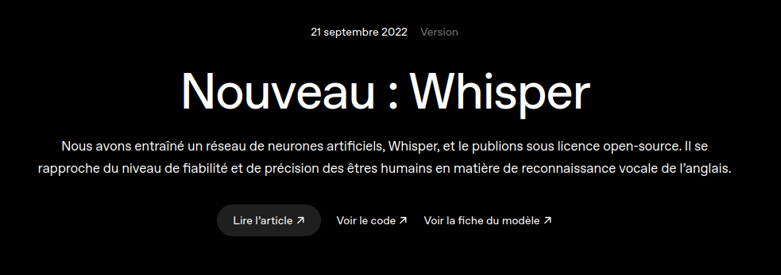

+++
title = "Notes de cours"
weight = 3
+++

### C'est quoi au juste, WhisperAI?

WhisperAI est un système de reconnaissance automatique de la parole, développé par OpenAI.  
Il a été mis en ligne sous licence *open-source* le 21 septembre 2022. 

