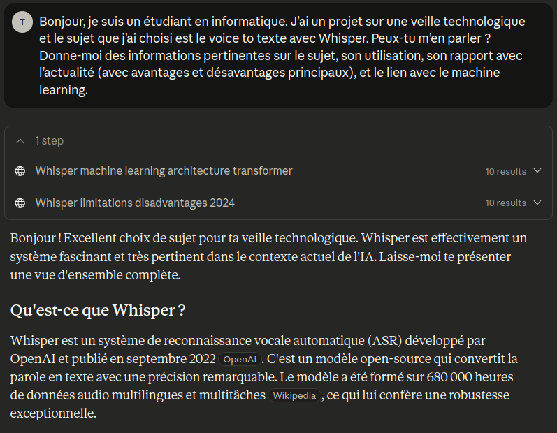
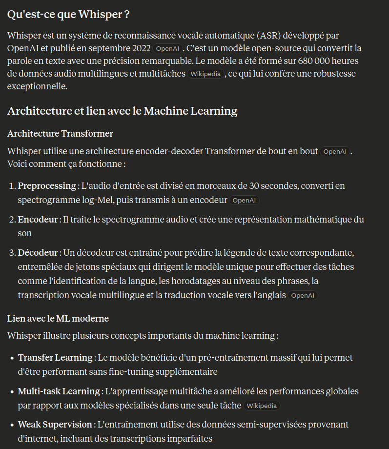
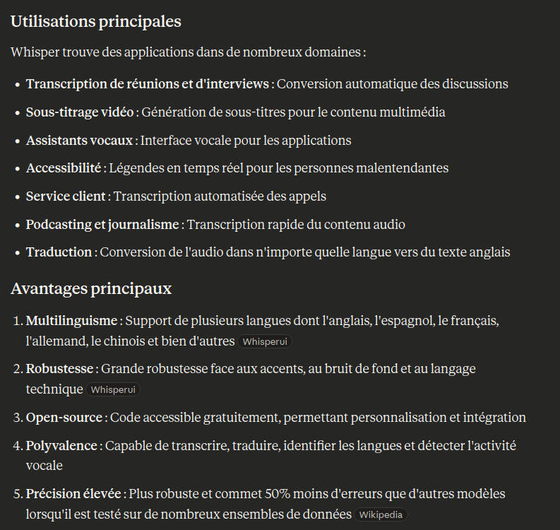
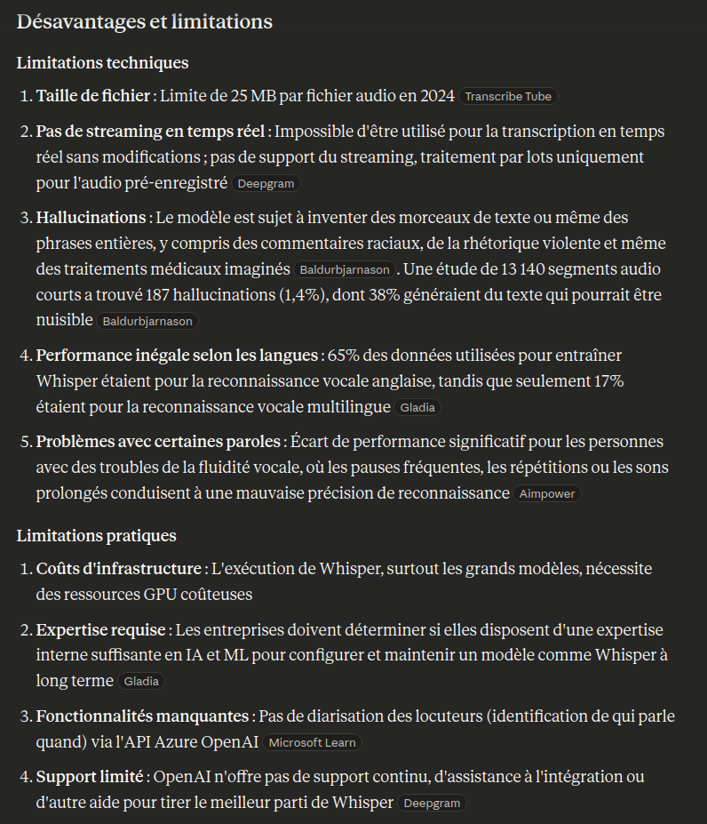
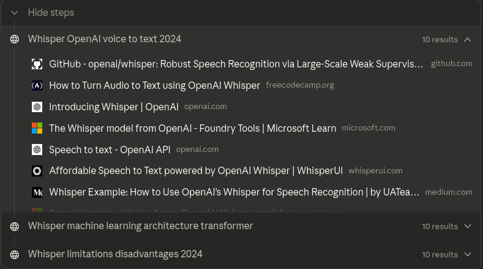
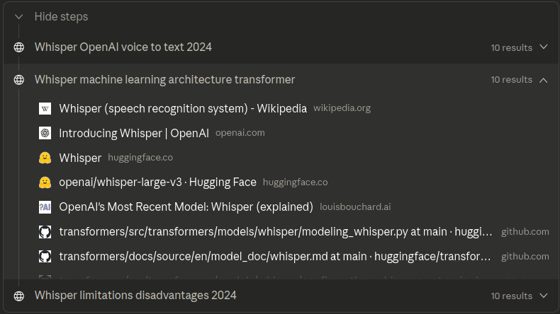
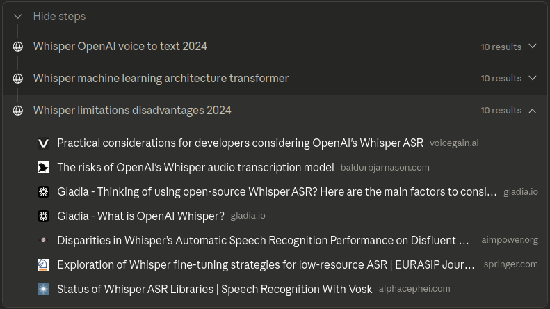
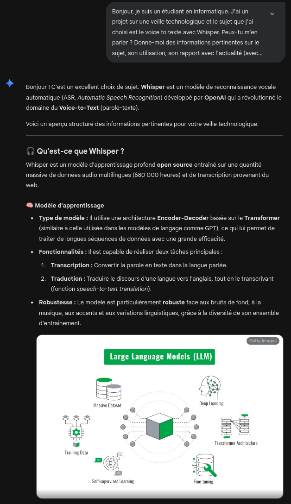
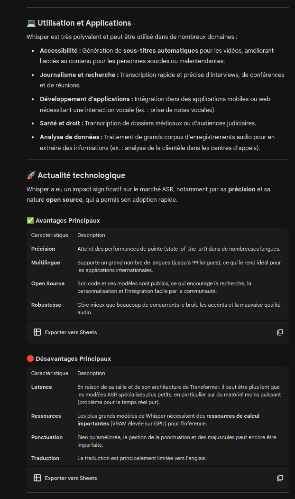
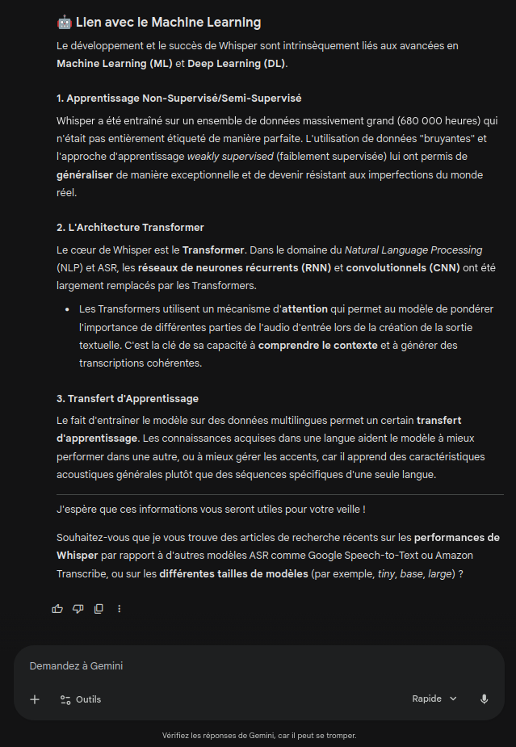

+++
title = "Veille technologique"
weight = 2
+++

> [!info]
> J'ai choisi de poser mon prompt à ­`Claude`. La raison est parce que vous nous l'aviez 
> conseillé au début de la session.  
>  
> Au début, je vais mettre le Prompt que j'ai envoyé à Claude et la réponse qu'il m'a envoyé. 
> Tout cela sera suivi par des explications.  
>  
> Le modèle de Claude utilisé ici est `Sonnet 4.5` comme on peut le voir à la fin de la dernière 
> image.

## Prompt envoyé à Claude

## Retour sur la réponse du LLM

> **Je vais répondre à plusieurs questions ici :**
> **Est ce que la réponse est**
> - complète?
> - comparable à un moteur de recherche?
> - comparable à un autre LLM?
> - comparable à ce que je connais déjà?  
>  
> **Et finalement :**
> - Est ce que j'ai trouvé une page web qui contient déjà toutes les informations fournis par le llm?

### 1. Est ce que la réponse est complète?
Je pense que la réponse de Claude est vraiment complète, comparée avec le prompt que je lui ai donné. Elle est pertinente, et elle couvre bien les éléments que j'ai demandées. Cependant, elle reste générale et ne permet pas, à elle seule, de contruire des notes de cours approfondies. Il faudra faire des recherches supplémentaires, que ce soit avec des blogs, des sites officiels de OpenAI et de WhisperAI, sur youtube et les réseaux sociaux ou sur d'autres sources. Je tiens à dire qu'on peut poser des questions ou des prompts plus précis au llm, et de cette façon il nous donnera des réponses plus précises et mieux construites.

> Je vais mettre le lien du chat avec Claude à la fin, avec les sources. Je vais faire ma recherche personnelle et je vais aussi utiliser Claude. De cette façon, je pense que ça ne fera pas de mal, au contraire, ça maximisera ma chance d'avoir des informations importantes que je n'aurais peut-être pas pu avoir en fesant une recherche seulement ou en utilisant un llm seulement.

### 2. Est ce que la réponse est comparable à un moteur de recherche?
Le truc avec les moteurs de recherche est qu'on peut trouver facilement beaucoup de sources, mais il faudra aller chercher les informations nous même. Ça prend de l'effort, car on peut passer beaucoup de temps parfois sans avoir récolté beaucoup d'informations valables. 

D'un autre point de vue, un moteur de recherche offre, comme j'ai déjà dis dans la première partie de ma réponse, beaucoup de sources. Cela me permet de faire une recherche beaucoup plus approffondie, de récolter beaucoup plus d'informations et d'avoir des preuves de mes sources.

Les llm, bien qu'ils ne fournissent pas autant d'informations, ils facilitent la recherche générales et nous donnent leurs sources (les sites qu'ils ont utilisé). Voici les sources que Claude a utilisé pour répondre à mon prompt:

- Whisper OpenAI voice to text 2024
    - https://github.com/openai/whisper
    - https://www.freecodecamp.org/news/how-to-turn-audio-to-text-using-openai-whisper/
    - https://openai.com/index/whisper/
    - https://learn.microsoft.com/en-us/azure/ai-services/speech-service/whisper-overview
    - https://platform.openai.com/docs/guides/speech-to-text
    - https://whisperui.com/
    - https://medium.com/@aleksej.gudkov/whisper-example-how-to-use-openais-whisper-for-speech-recognition-6196c758d47d
    - https://learn.microsoft.com/en-us/azure/ai-foundry/openai/whisper-quickstart?-view=foundry-classic
    - https://community.openai.com/t/voice-to-text-via-whisper-integration-in-chatgpt-web-app/685231
    - https://whisperai.com/

 
- Whisper machine learning architecture transformer
    - https://en.wikipedia.org/wiki/Whisper_(speech_recognition_system)
    - https://openai.com/index/whisper/
    - https://huggingface.co/docs/transformers/en/model_doc/whisper
    - https://huggingface.co/openai/whisper-large-v3
    - https://www.louisbouchard.ai/whisper/
    - https://github.com/huggingface/transformers/blob/main/src/transformers/models/whisper/modeling_whisper.py
    - https://github.com/huggingface/transformers/blob/main/docs/source/en/model_doc/whisper.md
    - https://github.com/huggingface/transformers/blob/main/src/transformers/models/whisper/configuration_whisper.py
    - https://github.com/openai/whisper/discussions/654
    - https://www.gladia.io/blog/what-is-openai-whisper

 
- Whisper limitations disadvantages 2024
    - https://learn.microsoft.com/en-us/answers/questions/1638419/whisper-model-limitation
    - https://www.transcribetube.com/blog/openai-whisper-api-limits
    - https://deepgram.com/learn/whisper-issues-smart-formatting
    - https://www.voicegain.ai/post/practical-considerations-for-voice-developers-considering-openais-whisper-asr
    - https://www.baldurbjarnason.com/2024/openai-whisper-risks/
    - https://www.gladia.io/blog/thinking-of-using-open-source-whisper-asr-here-are-the-main-factors-to-consider
    - https://www.gladia.io/blog/what-is-openai-whisper
    - https://aimpower.org/2024/11/07/disparities-in-whispers-automatic-speech-recognition-performance-on-disfluent-speech/
    - https://link.springer.com/article/10.1186/s13636-024-00349-3
    - https://alphacephei.com/nsh/2024/04/20/status-of-whisper.html

 
Pour faire un petit récapitulatif, en terme de temps, un llm peut-être plus rapide, mais en conséquences, les informations ne seront pas aussi normbreuses ou précises que si on utilisait un moteur de recherche. Je dis cela parce que les llm synthétise, il résument beaucoup et choisissent quelles informations elles veulent nous montrer selon notre demande (prompt). 
 
`INFOS SUPPLÉMENTAIRES` 
En terme de structure, les informations qu'un llm nous donne sont très variables. Le llm prend des informations de plusieurs sites et nous les donne d'un coup, donc on aura que peu d'informations de chaque point du sujet. En utilisant Google par exemple, chaque site est bien construit, obtient beaucoup plus d'informations en lien avec un même point et peut nous être beaucoup plus valable. Cependant, il ne faut pas oublier que beaucoup les informations sont éparpillés. Il faudra les trier selon ce qui nous est important ou utile et reconstruire l'explication dans notre tête.  
 
Finalement, en terme de fiabilité, Claude, ou les llm, ont tendance à beaucoup synthétiser, donner une vue cohérente et ils nous sont très utiles pour comprendre un certain sujet. L'inconvénient avec les llm est qu'ils ne montrent pas toujours et clairement chaque informations provient d'où exactement. Ils peuvent se tromper, simplifier ou même halluciner et donner de fausses informations parfois. Si on compare cela avec Google, ou n'importe quel moteur de recherche, on a toujours accès aux sources originales. Cela veut dire qu'on peut toujours vérifier qui a écrit, quand il l'a écrit et dans quel contexte ça a été écrit. Bien sûr, ça reste long et exigeant de vérifier les informations et parfois il y a des sites qui donnent de fausses informations, mais au final on ne peut pas tout contrôler.  
 
Si on regarde si bas par exemple, Claude nous donne la source de la première et de la troisième information, mais il ne donne pas de source pour la deuxième!

### 3. Est ce que la réponse est comparable à un autre llm?

J'ai posé le même prompt à `Gemini`. Je vous montre sa réponse tout d'abord, et je vais faire un retour dessus après.

 
Comme on peut voir dans la réponse de Gemini, sa rééponse est mieux structurée, plus facile à comprendre et plus claire même. Gemini nous donne même une image pour qu'on comprenne mieux, et j'aime beaucoup cela personnellement. Claude, de l'autre côté, va plus loin dans les détails et les limites. Il explique et parle des problèmes fréquents par exemple pour nous faire comprendre des détails que Gemini n'en parle pas. On peut dire que la réponse de Gemini est beaucoup plus neutre que celle de Claude qui est un peu plus nuancée.  
 
Selon le llm qu'on utilise, l'approche ne sera pas la même, et cela est parce qu'ils ont chacun un algorithme propre à eux qu'ils utilisent pour savoir comment nous répondre. 
 
Pour apprendre, Gemini est plus simple, mais pour analyser, je pense que Claude est clairement plus utile. 
 
Personnellement, je vais continuer à utiliser Claude. La raison principale qui m'a poussé à prendre cette décision est que Claude donne plus d'informations, il est plus nuancé, il explique plus et c'est de ça que j'ai besoin pour un grand projet. Je trouve que c'est un meilleur llm pour une Veille Technologique aussi. 

### 4. Est ce que la réponse est comparable à ce que je connais déjà?
Honnêtement, je ne connaissais rien sur Whisper ou sur le Voice to Texte. Grâce à Claude, j'ai appris beaucoup de choses. Bien sûr, je connaissais le nom Whisper et qu'il est un programme de Voice to Texte fait par OpenAI, je connaissais aussi qu'il est open source, mais c'est tout. 
 
Ce que j'ai appris est que Whisper a été publié en septembre 2022, ce qui veut dire qu'il est très récent. Il a été formé sur ÉNORMÉMENT D'HEURES de données multilingues, précisément 680 000 heures.   
 
J'ai une idée générale de ce que l'architecture Transformer est et je connais maintenant les étapes de comment Whisper analyse les fichiers d'audio (Preprocessing, Encodeur, Décodeur). J'ai appris comment Whisper a été entraîné et ce qui le différencie des autres modèles plus spécialisés.   
 
J'ai une idée générale de ce que ses avantages et désavantages sont par rapport aux autres modèles de transcription de voix. Je connais certaines informations précises sur ses limitations, comme le fait qu'il prend des fichiers audio de taille 25MB maximum. Bien sûr, cette information a été publiée en 2024, donc je vais devoir vérifier si elle est toujours à jour.  
 
Claude me parle du rapport de Whisper avec l'actualité (2024, ce qui est quand même récent), donc je suis informé sur où Whisper est utilisé, ce que les gens en pensent et ce que les grandes compagnies en pensent aussi. Je ne veux pas donner beaucoup d'informations ici, car je vais parler de tout cela dans la section Notes de Cours.

### 5. Est ce que j'ai trouvé une page web qui contient déjà toutes les informations fournis par le llm?

`!!!   À FAIRE APRÈS LES NOTES DE COURS   !!!`

## Sources choisies pour les notes de cours

`!!!   À FAIRE APRÈS LES NOTES DE COURS   !!!`

## Article récent qui traite de Whisper

`!!!   À FAIRE APRÈS LES NOTES DE COURS   !!!`

## Quelques sources réseaux sociaux / chaîne youtube

`!!!   À FAIRE APRÈS LES NOTES DE COURS   !!!`